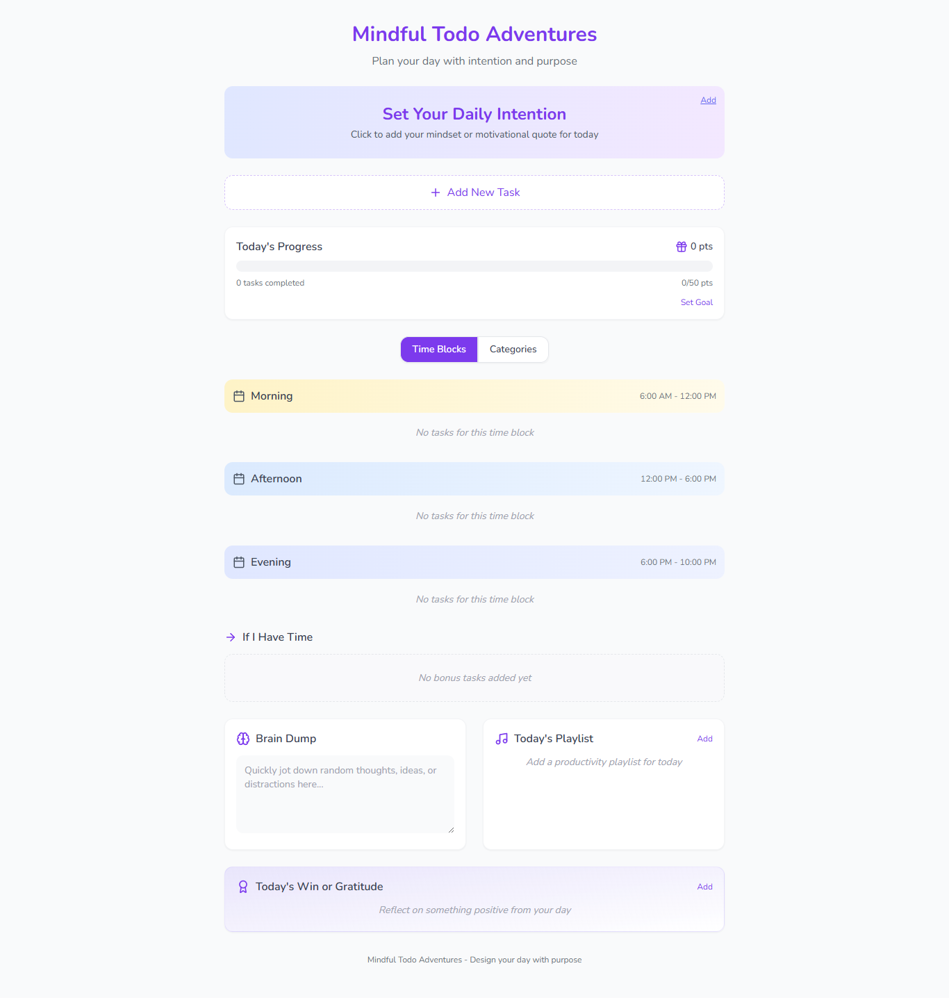

# Mindful Todo Adventures

A productivity application designed to help you plan your day with intention and purpose, combining task management with mindfulness practices.



## Features

### 1. Daily Focus & Intention Setting
- Set a daily intention or motivational quote to guide your day
- Easily editable focus area to adapt as your day evolves

### 2. Smart Task Management
- Create tasks with multiple attributes:
  - Categories (Projects, Follow-ups, Chores)
  - Time blocks (Morning, Afternoon, Evening)
  - Priority levels (Normal, Important, Urgent)
  - Point values for gamification

### 3. Time-Block Planning
- Organize tasks by time of day (Morning, Afternoon, Evening)
- Visual indicators for different time periods
- Helps maintain focus during specific parts of your day

### 4. Category-Based Organization
- Separate tasks by type:
  - Project tasks for focused work
  - Follow-up tasks for communication and coordination
  - Chore tasks for maintenance activities

### 5. "If I Have Time" Section
- Separate area for optional tasks
- Reduces pressure while keeping lower-priority items visible
- Helps manage expectations and reduce overwhelm

### 6. Brain Dump Area
- Capture random thoughts and ideas
- Keep your mind clear while preserving important insights
- Prevent distractions without losing valuable ideas

### 7. Gamification Elements
- Point system for completed tasks
- Progress tracking toward daily goals
- Visual feedback for accomplishments
- Customizable point goals

### 8. Daily Win & Gratitude
- Record your biggest accomplishment or gratitude for the day
- Promotes positive reflection and mindfulness
- Builds a record of achievements over time

### 9. Music Integration
- Link to focus music or playlists
- Enhance productivity with your preferred audio environment

### 10. Responsive Design
- Works seamlessly across devices
- Optimized for both desktop and mobile use

## Technology Stack

- **Frontend Framework**: React with TypeScript
- **Build Tool**: Vite
- **Styling**: Tailwind CSS with shadcn/ui components
- **State Management**: React Hooks
- **Routing**: React Router

## Getting Started

### Prerequisites
- Node.js & npm installed

### Installation

```sh
# Clone the repository
git clone <repository-url>

# Navigate to the project directory
cd mindful-todo-adventures

# Install dependencies
npm install

# Start the development server
npm run dev
```

The application will be available at `http://localhost:8080`

## Usage

1. Set your daily focus at the top of the page
2. Add tasks using the task form
3. Organize tasks by time block and category
4. Track your progress with the gamification stats
5. Record your daily wins and gratitude
6. Use the brain dump for capturing random thoughts

## Deployment

Build the project for production:

```sh
npm run build
```

The built files will be in the `dist` directory, ready to be deployed to your preferred hosting service.
